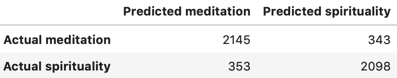
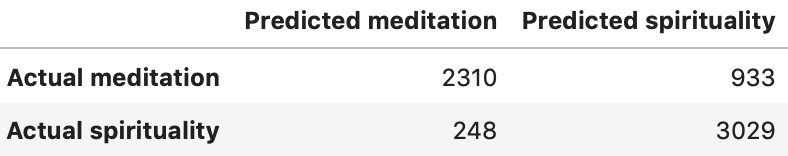

# Spirituality & Meditation - An Awakening NLP Experience - README
*Author: Joshua Leibow (LA)*

This repo houses my workflow and organization for an NLP Project that analyzes 2 Subreddit posts

## Executive Summary:

### Problem Statement:

To create a Machine Learning Classification model that takes a subreddit post from 1 of 2 topics (Spirituality & Meditation) and predicts which subreddit it came from.

## Background:
We live in a material world in which money, science and technology are ever present.  Though technology is supposed to make our lives easier and more connected, for some reason the  opposite is true.  For example,  we are more connected via social media, yet we feel more lonely and isolated.  In addition, we have more creature comforts and entertainment, yet we are more depressed and anxious.  This begs the question.  Do we have technology or does technology have us?

The Solution:
Breathing techniques, yoga, meditation, prayer, spiritual knowledge, family time, reading, writing, hiking, communal activities etc.

Spirituality:
Everyone is technically spiritual by nature of the fact that the 3Dimensional part of ourselves is only a small part of our existence.  While some people hardly give thought to their higher selves, other people spend a lot of time and energy on their spirituality to the point that it even spills over into engaging in dialogue about it on Reddit.

Meditation:
Additionally, there are people who have a meditation practice that they set aside time for every day.  While meditation can be a spiritual experience, it also has many practical qualities.  Meditation is documented to lower blood pressure, stimulate the immune system and help with focus.

What is Spirituality?
“Spirituality is a broad concept with many perspectives. In general, it includes a sense of connection to something bigger than ourselves, and it typically involves a search for meaning in life. As such, it is a universal human experience—something that touches us all.” [Taking Charge of Your Wellbeing - University of Minesota](https://www.takingcharge.csh.umn.edu/what-spirituality)

What is Meditation?
“Meditation is the process of quieting the mind in order to spend time in thought for relaxation or religious/spiritual purposes. The goal is to attain an inner state of awareness and intensify personal and spiritual growth. In practice, meditation involves concentrated focus on something such as a sound, image or feeling.” [Yogapedia](https://www.yogapedia.com/definition/4949/meditation)

## Contents:

This notebook begins with JSON data importation using the Pushshift API.  I then clean the data and perform EDA / Data Visualization.  Following, I use NLP tools such as Reg ex to parse words from the titles and self text of each post, as well as Stop Words to remove words such as just, like, and really.  Such words among many others are common fill-in words that are prevalent in the english language.  NLP analysis is performed by evaluating character count, word count and sentiment.  In addition the weights of the coefficients are analyzed after running the Logistic Regression model on the data.  

- [Pushift API scrape of Subreddits (Spirituality & Meditation)](./code/01_Pushshift.ipynb)
- [Data Cleaning](./code/02_Clean.ipynb)
- [Logistic Regression Model](./code/03A_Logistic-Regression-.ipynb)
- [Decision Tree Model](./code/03B_Decision-Tree.ipynb)

## EDA NLP Findings:

The average character count of each post per subreddit was less than 1000 characters.  
The average word count of each post per subreddit was less than 150 words.

**The top 20 words in subreddit meditation:**  Meditation, Feel, Time, Mind, Meditating, Thoughts, One, I’ve, Know, Day, Life, Meditate, Body, Experience, Practicing, Feeling, Think Anyone, Back, Felt

**The top 20 words in subreddit spirituality:**  Life, One, Know, Feel, Time, Spiritual, Love, Things, Want, God, Think, World, Way, See, Mind, Us, Self, Much, Need, Could

**The top 7 overlapping words of spirituality and meditation:**  Life, One, Know, Feel, Time, Think, Mind.

**The top 10 Spiritual Coefficients weighted with Logistic Regression:** Tarot, Spiritual, Twice, Spiritually, Message, Numerology, Spirituality, Intuition, Mass, Evil

**The top 10 Spiritual Coefficients from Logisitic Regression with all derivatives of the word spiritual removed:** 
Tarot, Twice, Message, Numerology, Intuition, Mass, Evil, Festival, Randomly, Correct

**The top 10 Meditation Coefficients weighted with Logistic Regression:** Headspace, Meditation, Meditators, Meditationremoved, Meditate, Mantras, Mediation, Mouth, Serenity

**The top 10 Meditation Coefficients from Logisitic Regression with all derivatives of the word meditation removed:** 
Headspace, Mantras, Mouth, Serenity, Shared, Introverts, Practices, Funny, Supernatural, Bipolar
***
## Logistic Regression Results:
#### - Train Score: 0.980
#### - **Accuracy score:** 0.857
***
### Confusion Matrix:

***
- X- variables: ('text', 'word_count', 'sentiment')
- Features: Feature Union( numeric and word features), Standard Scaler and  Count Vectorizer
- Parameters: Lasso ('l1') and Ridge ('l2')
***
## Decision Tree Results:
#### - Train score: 0.817
#### **Accuracy score:** 0.819
***
### Confusion Matrix:

***
- X- variables: ‘text’, ‘word_count’, ‘sentiment
- Features: Feature Union( numeric and word features), Standard Scaler and  Count Vectorizer
- Parameters: max_depth': [5], min_samples_split': [7], min_samples_leaf': [3]

## Conclusions:
Though my Logistic Regression accuracy score was ultimately higher than the accuracy score of my Decision Tree model, the Decision tree model was more well fit than the Logistic Regression model.  We this evidenced by the difference between the train and test scores of each model.  The Logistic Regression train score was extremely high, at 98% accuracy, whereas the test score was about 86% accuracy. The discrepancy of scores suggests that my model was highly overfit.  The Decision tree model, by contrast had a train score of 81.7% accuracy and a test score of 91.8% accuracy, suggesting that the model was neither highly biased nor highly variant.  If I had to choose between models, I would choose the Logistic Regression model.

## Slides
The slides to my presentation are [available here.](./slides/spirmed.pdf)

### Sources:
1. Photo by Mohamed Nohassi on Unsplash
2. Photo by Jyotirmoy Gupta on Unsplash
3. Spirituality definition: https://www.takingcharge.csh.umn.edu/what-spirituality
4. Meditation definition https://www.yogapedia.com/definition/4949/meditation
5. Word Clouds created using Word Art.com
